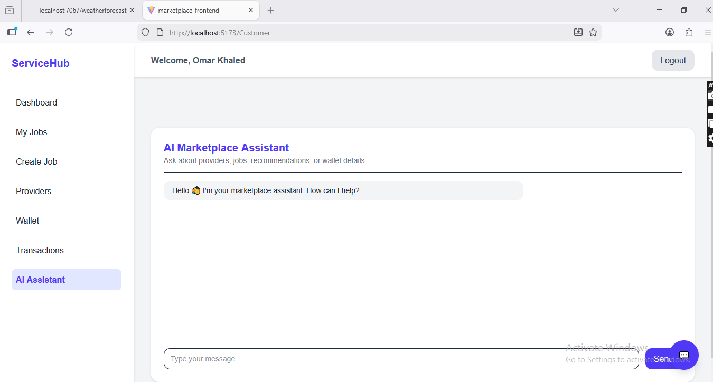

# AI-Powered Local Services Marketplace

A full-stack web platform that connects **customers** with **local service providers** (plumbers, electricians, technicians, etc.).  
The system enables customers to request services, providers to manage and complete jobs, and administrators to manage the platform.

The platform also integrates an **AI assistant powered by a Large Language Model (LLM)** that interacts with backend services to answer user questions and retrieve relevant data.

The project demonstrates **secure backend development, role-based access control, AI integration, and full-stack system design**.

## 🎥 Demo

# Key Features

## Role-Based Platform

The system supports **three types of users**:

- Administrator
- Customer
- Service Provider

Authentication and authorization are implemented using **JWT (JSON Web Tokens)** to secure backend APIs.

---

# Admin Capabilities

The administrator manages the platform and monitors its activity.

### User Management
- Activate and deactivate user accounts

### Platform Transactions
- View all transactions between customers and the platform

### Platform Earnings
- Monitor total platform earnings  
- The platform automatically takes **5% commission** from completed jobs

---

# Customer Features

## Dashboard
Displays important user statistics:

- Total jobs posted
- Active jobs
- Wallet balance

## My Jobs
Customers can:

- View all their jobs
- Track job status:
  - Open
  - Accepted
  - Completed
  - Cancelled
- Cancel active jobs
- Leave reviews and ratings after job completion

## Create Job

Customers can create a service request by providing:

- Job description
- Service category
- Selecting a provider within the category
- Customer location
- Emergency service option

## Providers Page

Browse available service providers with search functionality.

Customers can search providers by:

- Name
- Location

Provider profiles display:

- AI-generated summary based on customer reviews
- Biography
- Years of experience
- Trust score
- Phone number
- Available services
- Location

## Wallet System

Customers can deposit funds into their wallet (using **simulated / fake money**).

## Transactions

View all wallet transactions.

## AI Assistant

Customers can interact with an AI assistant to ask questions about the platform or services.

---

# Service Provider Features

## Dashboard

Displays provider statistics:

- Number of available jobs
- Number of assigned jobs
- Number of emergency jobs

## Jobs Management

Providers can:

- View all job requests assigned to them
- Accept jobs
- Cancel jobs
- Mark jobs as completed
- Specify the service cost that will be charged to the customer

## Services Management

Providers can add services they offer by specifying:

- Service category
- Minimum price
- Maximum price
- Service description

## Reviews

Providers can view customer reviews and ratings.

## Wallet

Providers have a wallet similar to customers where payments are received.

## AI Assistant

Providers can interact with the AI assistant.

## Profile Management

Providers can update their profile information.

---

# AI Assistant Architecture

The platform integrates a **Large Language Model (LLM)** to provide intelligent assistance.

The system follows a **tool-based AI interaction architecture**:

1. The **frontend (React)** sends a user message to the backend.
2. The **backend (ASP.NET Core)** forwards the request to the LLM.
3. The **LLM identifies the relevant backend method** required to answer the query.
4. The backend executes the requested method.
5. The method result is returned to the LLM.
6. The LLM generates a final response using the returned data.
7. The backend sends the final response to the frontend.

The LLM model is hosted in **Google Colab** and accessed through API communication.

This architecture demonstrates how **LLMs can interact with backend systems to retrieve structured data and generate intelligent responses**.

---

# Technology Stack

## Backend
- C#
- ASP.NET Core Web API
- Entity Framework
- SQL Server
- JWT Authentication

## Frontend
- React
- JavaScript (JSX)
- Axios

## AI Integration
- Large Language Model (LLM)
- Hosted on Google Colab

---

# Security

The backend API is protected using:

- JWT Authentication
- Role-based authorization
- Protected API endpoints

This ensures that only authorized users can access platform resources.

---

# Future Improvements

Possible future extensions:

- Real-time messaging between customers and providers
- Online payment integration
- AI-based service recommendations

---

# Author

**Oussama Al-Khatib**

Telecommunications and Computer Engineering  
Lebanese University  

Interests:

- Artificial Intelligence
- Full-Stack Development
- AI Systems Integration
>>>>>>> e4cb9d82a7fdee30dcaadb6d15c2272818ceb9cb
